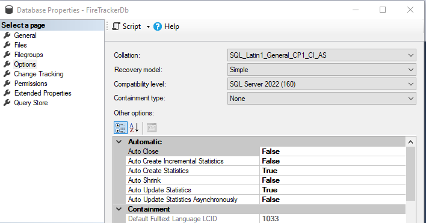
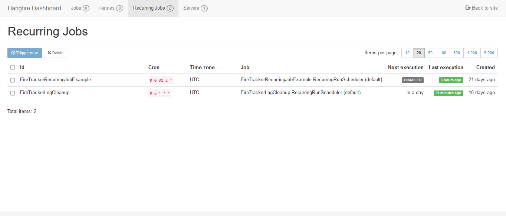

### **FireTracker - The Recurring Process Tracking Dashboard For Hangfire!**

---

#### Introduction

---

Hangfire is a fabulous open-source solution that allows users to process and manage background jobs.  Hangfire tracks jobs with persistent backend storage (i.e., SQL Server, Redis) and provides a web-based front-end dashboard to monitor the jobs.  Processes can be one-off or recurring, with recurring processes being run on-demand or on a schedule.

While the success or failure of Recurring Jobs can be viewed in the in Hangfire's Monitoring UI, it is not very easy to filter or review the history of specific Recurring Jobs out of the box (especially if you have the Pro Version and use a lot of batch continuations).  That is where FireTracker comes to the rescue.  It allows to track and view the history of Hangfire Recurring Jobs in a simple, convenient web UI.

---

#### Getting Started

---

Hangfire can be installed within a variety of .NET applications.  For this solution we will go through the basic setup of a .NET Core application and install Hangfire.  Then we will configure the rest of the FireTracker application and wire up the code to integrate recurring job tracking.  For a demo we will create a simple console application that can be run by a Hangfire recurring job, and show how FireTracker can view the jobs.

In this demo, we will use an ASP.NET Core Web App for the FireTracker front end (HD.FireTracker.Web).  Current version used is .NET 8.0.  To this we will add the following Hangfire packages to the app from NuGet:

- Hangfire.Core (1.8.14)

- Hangfire.AspNetCore (1.8.14)

And since we will be using SQL Server for persistent storage, we will add the following packages as well:

- Hangfire.SqlServer (1.8.14)

- Microsoft.Data.SqlClient (5.2.2)

##### Database Setup

Before proceeding further with the Hangfire configuration, make sure the the SQL Server Database (FireTrackerDb) is setup in SQL Server Management Studio (SSMS).



Once the database is created, it is on to the Hangfire configuration.

##### Basic Hangfire Configuration

In the appsettings.json file, add the connection string and logging settings.

```json
{
  "ConnectionStrings": {
    "HangfireConnection": "Server=.\\sqlexpress;Database=FireTrackerDb;Integrated Security=SSPI;TrustServerCertificate=True;"
  },
  "Logging": {
    "LogLevel": {
      "Default": "Warning",
      "Hangfire": "Information",
      "Microsoft.AspNetCore": "Warning",
      "Microsoft.EntityFrameworkCore.Database.Command": "Warning"
    }
  },
  "AllowedHosts": "*"
}
```

After updating the application settings, open the `Program.cs` file and add the following to main().

```csharp
using Microsoft.Extensions.DependencyInjection;
using Hangfire;
using Hangfire.SqlServer;
using Microsoft.Extensions.Configuration;

namespace HD.FireTracker.Web
{
    public class Program
    {
        public static void Main(string[] args)
        {
            var builder = WebApplication.CreateBuilder(args);

            var connString = builder.Configuration.GetConnectionString(HD.FireTracker.Common.Consts.ConstNames.HangfireConnection);

            // Add services to the container.
            builder.Services.AddControllersWithViews();

            //Add Hangfire services.
            builder.Services.AddHangfire(configuration => configuration
            .SetDataCompatibilityLevel(CompatibilityLevel.Version_180)
            .UseSimpleAssemblyNameTypeSerializer()
            .UseRecommendedSerializerSettings()
            .UseSerilogLogProvider()
            .UseSqlServerStorage
            (connString, new SqlServerStorageOptions
            { CommandBatchMaxTimeout = TimeSpan.FromMinutes(5),
              SlidingInvisibilityTimeout = TimeSpan.FromMinutes(5),
              QueuePollInterval = TimeSpan.Zero,
              UseRecommendedIsolationLevel = true,
              DisableGlobalLocks = true
            })
            );
            JobStorage.Current = new SqlServerStorage(connString);

            // Add the processing server
            builder.Services.AddHangfireServer();
          });
            var app = builder.Build();

            // Configure the HTTP request pipeline.
            if (!app.Environment.IsDevelopment())
            {
                app.UseExceptionHandler("/Home/Error");
                // The default HSTS value is 30 days. You may want to change this for production scenarios, see https://aka.ms/aspnetcore-hsts.
                app.UseHsts();
                  app.UseHttpsRedirection();
            app.UseStaticFiles();
            app.UseHangfireDashboard();

            app.UseRouting();

            app.UseAuthorization();

            app.MapControllerRoute(
                name: "default",
                pattern: "{controller=Home}/{action=Index}/{id?}");

            app.Run();      }

        }
    }
}
```

Go ahead and start HD.FireTracker.Web in the VS Debugger, and then browse to https://localhost:7089/hangfire (your port may differ).  There you will see the Hangfire Dashboard in your browser.


Firing up the Hangfire Dashboard results in the application creating all of the necessary  tables in the persistent data store.


When you finished working with the application, press the Ctrl+C in your console window to stop the application.

Now that the basic setup of Hangfire is complete, the rest of the FireTracker application can be configured.

---

#### FireTracker Setup

---

##### Solution Overview

In order to provide additional support for tracking Recurring Jobs, FireTracker will add some custom tables along side the default Hangfire tables in the persistent data store used for the application.  A couple of projects will be used to support viewing and updating the Recurring Jobs data.

- HD.FireTracker.Common

- HD.FireTracker.Common.DTO

- HD.FireTracker.DB.FireTrackerDB

- HD.FireTracker.Data.Common

- HD.FireTracker.Data.Service

- HD.FireTracker.Web

##### Data Access

Different approaches can be taken when designing data access for applications.  In this project we will aim to isolate specific database access technologies (Entity Framework, Dapper, etc.) from the rest of the application and provide a clean separation between our DTOs and entity Models  (using object mapping libraries to tie them together), all while trying to maintain a balance with simplicity and practicality.  The project is a layered design inspired by Hexagonal Architecture.  The net result is a data service layer called by a web front-end that is relatively free of dependencies on the data access tier.


###### Repositories

The HD.FireTracker.Data.Common ("Data.Common") and HD.FireTracker.DB.FireTrackerDB ("FireTrackerDB") projects work together to provide database access.  The Data.Common project defines the repository interfaces as well as the entity models (which include any database/ORM specific implementations not required by DTOs/rest of the application).  The FIreTrackerDB project implements the repository interfaces and also holds the Entity Framework database context.

###### Services

The HD.FireTracker.Data.Service ("Data.Service") project serves as a bridge exposing data access while insulating the rest of the application from the implementation specific details found in the FireTrackerDB project.  The services accomplish this by executing dependency injected interfaces and returning common DTOs back to the callers.

Object mappers are a key feature of the clean architecture provided by the services.  The Data.Service project uses AutoMapper to transform the entity models returned by the repositories to the DTOs used by the rest of the application.  AutoMapper uses Profile classes to define the mappings between classes.  In Data.Service a relatively straightforward class named MappingProfile defines the mappings.

**MappingProfile.cs**

```csharp
using System;
using System.Collections.Generic;
using System.Linq;
using System.Text;
using System.Threading.Tasks;
using AutoMapper;
using DomainDTO = HD.FireTracker.Common.DTO.DomainObjects;
using DBModel = HD.FireTracker.Data.Common.Models;

namespace HD.FireTracker.Data.Service.Mapper
{
    public class MappingProfile : Profile
    {
        public MappingProfile()
        {
            CreateMap<DBModel.FireTrackerDB.RecurringProcess, DomainDTO.RecurringProcessDTO>().ReverseMap();
            CreateMap<DBModel.FireTrackerDB.RecurringProcessDetail, DomainDTO.RecurringProcessDetailDTO>().ReverseMap();
            CreateMap<DBModel.FireTrackerDB.RecurringProcessDetailProjection, DomainDTO.RecurringProcessDetailProjectionDTO>().ReverseMap();
            CreateMap<DBModel.FireTrackerDB.RecurringProcessSummary, DomainDTO.RecurringProcessSummaryDTO>().ReverseMap();

        }

    }//end class
}
```

The RecurringProcessService is an example of one of the services.  The IRecurringProcessRepository is injected in the class.  We are able to get a list of latest processes by calling the repository's GetLatestProcesses() method, and mapping the collection of RecurringProcess Model objects to RecurringProcessDTOs.   As can be seen, consumers of the GetLatestProcesses method have no knowledge of the underlying ORM used to access the FireTrackerDB database.  The repositories could be using Entity Framework or they could be using Dapper.   Consumers of GetLatestProcesses are insulated from this.

**RecurringProcessService.cs**

```csharp
using System;
using System.Collections.Generic;
using System.Linq;
using System.Text;
using System.Threading.Tasks;
using AutoMapper;
using HD.FireTracker.Common.DTO.DomainObjects;
using HD.FireTracker.Data.Comon.IRepositories.FireTrackerDB.ModelRepo;
using HD.FireTracker.Data.Service.Interfaces.IServices.Repository.FireTrackerDB;

namespace HD.FireTracker.Data.Service.Services.Repository.FireTrackerDB
{
    public class RecurringProcessService : IRecurringProcessService
    {

        private readonly IRecurringProcessRepository _repository;
        private readonly IMapper _mapper;


        public RecurringProcessService(IRecurringProcessRepository recurringProcessRepository, IMapper mapper)
        {
            _repository = recurringProcessRepository ?? throw new ArgumentNullException(nameof(recurringProcessRepository));
            _mapper = mapper ?? throw new ArgumentNullException("mapper");
        }

        public IEnumerable<RecurringProcessDTO> GetLatestProcesses(int count)
        {
            var repoResults = _repository.GetLatestProcesses(count);

            IEnumerable<RecurringProcessDTO> serviceResults = _mapper.Map<IEnumerable<RecurringProcessDTO>>(repoResults);

            return serviceResults;
        }

        public IEnumerable<RecurringProcessDTO> GetRecurringJobNameProcesses(string recurringJobName)
        {

            var repoResults = _repository.GetRecurringJobNameProcesses(recurringJobName);

            IEnumerable<RecurringProcessDTO> serviceResults = _mapper.Map<IEnumerable<RecurringProcessDTO>>(repoResults);

            return serviceResults;

        }
    }//end class
}
```

##### Process Logging

The key to tracking our RecurringJobs is logging to our custom tracking tables.  We will set up a basic logging interface to help track RecurringJobs.

```csharp
    public interface IFireTrackerLogger
    {
        void LogStartRecurringJobProcess(string TaskManagerProcessId, string RecurringJobName, int DaysToCleanup);
        void LogEndRecurringJobProcess(string TaskManagerProcessId);
        void LogRecurringJobProcessInfo(string TaskManagerProcessId, string Message);

    }
```

Serilog logger configuration filters will make it easy to write log messages to our custom tables, so we will go ahead and install Serilog in the project.  

Filters are defined in the LoggerConfiguration in the program setup.  Log messages containing the keys "RecurringProcess" or "RecurringProcessDetail" are logged to the corresponding tables (which will later be queried and displayed by the custom dashboard). All other messages will sink to our "HangFireEvents" table.

```csharp
            //In Program.cs...

            #region "Region: Serilog"

            //Serilog
            var columnOptionsRecurringProcess = new ColumnOptions
            {
                AdditionalColumns = new List<SqlColumn>
                {
                    new SqlColumn{ ColumnName = "TaskManagerProcessId", PropertyName="TaskManagerProcessId", DataType=System.Data.SqlDbType.VarChar, DataLength=50, AllowNull=true}, 
                    new SqlColumn{ ColumnName = "RecurringJobName", PropertyName="RecurringJobName", DataType=System.Data.SqlDbType.VarChar, DataLength=256, AllowNull=true },
                    new SqlColumn{ ColumnName = "LogCleanupDate", PropertyName="LogCleanupDate", DataType=System.Data.SqlDbType.DateTime2, DataLength=256, AllowNull=true },
                }
            };

            var columnOptionsRecurringProcessDetail = new ColumnOptions
            {
                AdditionalColumns = new List<SqlColumn>
                {
                    new SqlColumn{ ColumnName = "TaskManagerProcessId", PropertyName="TaskManagerProcessId", DataType=System.Data.SqlDbType.VarChar, DataLength=50, AllowNull=true},
                    new SqlColumn{ ColumnName = "MessageType", PropertyName="MessageType", DataType=System.Data.SqlDbType.VarChar, DataLength=20, AllowNull=true },
                    new SqlColumn{ ColumnName = "FireTrackerMsg", PropertyName="FireTrackerMsg", DataType=System.Data.SqlDbType.VarChar, DataLength = -1, AllowNull=true },
                }
            };

            Log.Logger = new LoggerConfiguration()
                .WriteTo.Logger(mainLogger => mainLogger.Filter.ByExcluding(e => e.Properties.ContainsKey("RecurringProcess") || e.Properties.ContainsKey("RecurringProcessDetail"))
                .WriteTo.MSSqlServer(
                    connectionString: connString,
                    sinkOptions: new MSSqlServerSinkOptions { TableName = "HangFireEvents", AutoCreateSqlTable = false}
                 ))

                .WriteTo.Logger(mainLogger => mainLogger.Filter.ByIncludingOnly(e => e.Properties.ContainsKey("RecurringProcess"))
                .WriteTo.MSSqlServer(
                    connectionString: connString,
                    sinkOptions: new MSSqlServerSinkOptions { TableName = "RecurringProcess", AutoCreateSqlTable = false },
                    columnOptions: columnOptionsRecurringProcess
                 ))

                .WriteTo.Logger(mainLogger => mainLogger.Filter.ByIncludingOnly(e => e.Properties.ContainsKey("RecurringProcessDetail"))
                .WriteTo.MSSqlServer(
                    connectionString: connString,
                    sinkOptions: new MSSqlServerSinkOptions { TableName = "RecurringProcessDetail", AutoCreateSqlTable = false },
                    columnOptions: columnOptionsRecurringProcessDetail
                 ))
                .MinimumLevel.Information()
                .CreateLogger();

            #endregion
```

Logging using the filters is then implemented in FireTrackerLogger.cs

```csharp
    public class FireTrackerLogger : IFireTrackerLogger
    {
        public void LogStartRecurringJobProcess(string TaskManagerProcessId, string RecurringJobName, int DaysToCleanup)
        {
            Log.Information("RecurringProcess: {RecurringProcess}; TaskManagerProcessId: {TaskManagerProcessId}; RecurringJobName: {RecurringJobName}; LogCleanupDate: {LogCleanupDate}", true, TaskManagerProcessId, RecurringJobName, DateTime.Now.AddDays(DaysToCleanup));
            Log.Information("RecurringProcessDetail: {RecurringProcessDetail}; TaskManagerProcessId: {TaskManagerProcessId}; MessageType: {MessageType}", true, TaskManagerProcessId, "Start");
        }

        public void LogRecurringJobProcessInfo(string TaskManagerProcessId, string Message)
        {
            Log.Information("RecurringProcessDetail: {RecurringProcessDetail}; TaskManagerProcessId: {TaskManagerProcessId}; MessageType: {MessageType}; FireTrackerMsg: {FireTrackerMsg}", true, TaskManagerProcessId, "Detail", Message);
        }

        public void LogEndRecurringJobProcess(string TaskManagerProcessId)
        {
            Log.Information("RecurringProcessDetail: {RecurringProcessDetail}; TaskManagerProcessId: {TaskManagerProcessId}; MessageType: {MessageType}", true, TaskManagerProcessId, "End");

        }
    }
```

##### Scheduling Recurring Jobs

Hangfire allows users to create Recurring Jobs that can be run on a schedule or executed on demand using the Hangfire Dashboard.


FireTracker makes it easy to schedule Recurring Jobs in a few simple steps that will also take care of all of the basic logging allowing us to track and view the history of our jobs.

Implementing a Recurring Job in FireTracker is simple.  Create a class that inherits from RecurringJobProjectBase, and override the ScheduleRecurringJobRun() method.  Once this is done, simply schedule the recurring job by adding it in the Program setup.  We will illustrate this using a sample job (FireTrackerRecurringJobExample) and FireTrackerLogCleanup (maintenance job to cleanup old log entries), both included in the application.

**FireTrackerRecurringJobExample.cs**

```csharp
    [LogEverything]
    public class FireTrackerRecurringJobExample : RecurringJobCommon.RecurringJobProjectBase
    {
        public FireTrackerRecuringJobExample()
        {
        }


        public FireTrackerRecurringJobExample(IFireTrackerLogger fireTrackerLogger, IRecurringJobConfigSettings appSettings)
        {
            this._logger = fireTrackerLogger;
            this._appSettings = appSettings;

        }


        /// <summary>
        /// Must implement to schedule job
        /// </summary>
        /// <returns></returns>
        public override object ScheduleRecurringJobRun(string taskManagerProjectId)
        {
            var retVal = Hangfire.BackgroundJob.Enqueue(() => ExampleJob(taskManagerProjectId) );

            return retVal;
        }

        public string ExampleJob(string taskMgrProjectId)
        {

            this._logger.LogRecurringJobProcessInfo(taskMgrProjectId, "Log message from ExampleJob():  " + DateTime.Now.ToString("yyyy-MM-dd HH:mm:ss"));

            return "ExampleJob Finished.";
        }
    }
```

We start by injecting IFireTrackerLogger (our logging class shown above), and IRecurringJobConfigSettings for config file access.  Next we write a method that implements whatever work we want the job to accomplish.  In this case the method ExampleJob() is pretty simple, writing messages to the custom logging table.  Then we enqueue the ExampleJob() method in the overridden ScheduleRecurringJobRun() method.

Finally to schedule the Recurring Job, simply add the job to the GetRecurringJobList method in RecurringJobScheduler.cs. 

**RecurringJobScheduler.cs**

```csharp
    public static class RecurringJobScheduler
    {

        public static List<RecurringJobProjectBase> GetRecurringJobList()
        {
            List<RecurringJobProjectBase> recurringJobs = new List<RecurringJobProjectBase>();

            //add Recurring Jobs to list here --------------------------------
            recurringJobs.Add(new FireTrackerRecurringJobExample());
            recurringJobs.Add(new FireTrackerLogCleanup());
            //----------------------------------------------------------------
            return recurringJobs;
        }

    }//end class
```

Code in Program.cs will iterate through the GetRecurringJobList and add Recurring Jobs to Hangfire.

**Program.cs**

```csharp
RecurringJobConfigSettings recurringJobConfigSettings = new RecurrinJobConfigSettings(builder.Configuration);
//Schedule Recurring Jobs            
foreach (RecurringJobProjectBase project in RecurringJobScheduler.GetRecurringJobList())
{
  project.SetRecurringJobConfigurations(recurringJobConfigSettings);
  RecurringJobOptions rjo  = new RecurringJobOptions();
  rjo.TimeZone = TimeZoneInfo.Local;

  Hangfire.RecurringJob.AddOrUpdate(project.GetRecurringJobName(), project.RecurringJobDefaultQueue.GetNonNullValue("default"), project.GetTaskExpression(), project.CronSchedule, rjo);
}
```

**FireTrackerLogCleanup**

When we log messages using IFireTrackerLogger, the messages get logged to the RecurringProcess and RecurringProcessDetail tables.  One of the fields that gets populated on the RecurringProcess table is LogCleanupDate, which is set to a date in the future (based on the current date + DaysToLogCleanup).

FireTrackerLogCleanup uses the IRecurringProcessLogCleanupService, which queries the RecurringProcess table finding messages where the LogCleanupDate is expired (based on the current date).  Expired messages are deleted from the RecurringProcess and corresponding RecurringProcessDetail tables.  The job can be set to run on a scheduled basis defined by the CronSchedule.

**FireTrackerLogCleanup.cs**

```csharp
    [LogEverything]
    public class FireTrackerLogCleanup : RecurringJobCommon.RecurringJobProjectBase
    {
        private IRecurringProcessLogCleanupService _logCleanupServic;

        public FireTrackerLogCleanup()
        {

        }

        public FireTrackerLogCleanup(IFireTrackerLogger fireTrackerLogger, IRecurringJobConfigSettings appSettings, IRecurringProcessLogCleanupService logCleanupService)
        {
            this._logger = fireTrackerLogger;
            this._appSettings = appSettings;
            this._logCleanupService = logCleanupService;

        }

        public override object ScheduleRecurringJobRun(string taskManagerProjectId)
        {
            var retVal = Hangfire.BackgroundJob.Enqueue(() => StartRecurringLogCleanup(taskManagerProjectId));

            return retVal;
        }

        public string StartRecurringLogCleanup(string taskMgrProjectId)
        {
            this._logger.LogRecurringJobProcessInfo(taskMgrProjectId, "Beginning StartRecurringLogCleanup():  " + DateTime.Now.ToString("yyyy-MM-dd HH:mm:ss"));
            this._logCleanupService.RunRecurringProcessLogCleanup();
            return "Finished Recurring Process Log Cleanup: " + DateTime.Now.ToString("f");
        }
    }//end class
```

That takes care of scheduling a Recurring Job.  The RecurringJobProjectBase class adds the Start/End logging for us, which will allow us to track each run of the Recurring Job. And we can add extra logging by calling LogRecurringJobProcessInfo().

##### Recurring Process Configuration

A number of settings can be configured for our Recurring Jobs.  Default values are set for these settings in RecurringJobProjectBase.  However we can configure these settings in appsettings.json on a per job basis.  If the settings are omitted from the appsettings.json file, the application will fall back to the defaults.

**appsettings.json**

```json
    "FireTrackerRecurringJobSettings": {
    "FireTrackerRecurringJobExample": {
      "RecurringJobDefaultQueue": "default",
      "CronSchedule": "0 0 31 2 *",
      "DaysToLogCleanup": 90,
      "UseRunBlockCheck": true
    },
    "FireTrackerLogCleanup": {
      "RecurringJobDefaultQueue": "default",
      "CronSchedule": "0 6 * * *",
      "DaysToLogCleanup": 180,
      "UseRunBlockCheck": true
    }
  }
```

In our appsettings.json file, we have a section named "FireTrackerRecurringJobSettings", and each Recurring Job has its settings listed by Recurring Job class name.  The following four properties are available for configuration.

- RecurringJobDefaultQueue:  Allows setting the default queue for Hangfire's Job Queue feature.  

- CronSchedule:  Allows customizing the schedule for the Recurring Job, using a CRON expression ([Performing Recurrent Tasks](https://docs.hangfire.io/en/latest/background-methods/performing-recurrent-tasks.html)).

- DaysToLogCleanup:  Schedules the FireTracker logs for cleanup, using the optional FireTrackerLogCleanup recurring job, or any custom created job process (SQL Job, Windows Task Scheduler, etc.).

- UseRunBlockCheck:  When a given Recurring Job is processing, this setting enables a check to prevent another job from running if triggered.

Using IConfigurationSection with Get<T>() makes it easy to access our JSON config settings by mapping them to C# code.  We will take the JSON structure above and map it to a Dictionary, with the key being the class name of each Recurring Job and the value  being an object representing the settings.

**RecurringJobSettings (represents settings)**

```csharp
    public class RecurringJobSettings
    {

        public string RecurringJobDefaultQueue { get; set; } = "";

        public string CronSchedule { get; set; } = "";

        public int? DaysToLogCleanup { get; set; }

        public bool? UseRunBlockCheck { get; set; }

    }
```

**FireTrackerRecurringJobSettings (DIctionary)**

```csharp
/// <summary>
/// Setup for custom appsettings.config section
/// </summary>
public class FireTrackerRecurringJobSettings : Dictionary<string, RecurringJobSettings>
{
    public FireTrackerRecurringJobSettings()
    {

    }

    public string GetRecurringJobDefaultQueue(string RecurringJobName)
    {
        if (this.ContainsKey(RecurringJobName))
        {
            return this[RecurringJobName].RecurringJobDefaultQueue.GetNonNullValue();

        }
        else
        {
            return string.Empty;
        }

    }

    public string GetCronSchedule(string RecurringJobName)
    {
        if (this.ContainsKey(RecurringJobName))
        {
            return this[RecurringJobName].CronSchedule.GetNonNullValue();

        }
        else
        {
            return string.Empty;
        }

    }

    public int? GetDaysToLogCleanup(string RecurringJobName)
    {
        if (this.ContainsKey(RecurringJobName))
        {
            return this[RecurringJobName].DaysToLogCleanup;

        }
        else
        {
            return null;
        }

    }


    public bool? GetUseRunBlockCheck(string RecurringJobName)
    {
        if (this.ContainsKey(RecurringJobName))
        {
            return this[RecurringJobName].UseRunBlockCheck;

        }
        else
        {
            return null;
        }

    }
}//end class
```

FireTrackerRecurringJobSettings is actually an extension of Dictionary<TKey, TValue>.  It has all of the properties of a Dictionary, plus custom methods that we have added to retrieve properties by the name of the Recurring Job.  This Dictionary will be wrapped by RecurringJobConfigSettings and injected using  IRecurringJobConfigSettings.

**IRecurringJobConfigSettings**

```csharp
    public interface IRecurringJobConfigSettings
    {
       HD.FireTracker.Common.Classes.CustomConfig.FireTrackerRecurringJobSettings ConfigSettings { get; }
    }
```

**RecurringJobConfigSettings**

```csharp
  public class RecurringJobConfigSettings : IRecurringJobConfigSettings
    {
        private readonly IConfigurationSection _configSection;

        public RecurringJobConfigSettings(IConfiguration configuration)
        {            
            if (configuration.GetSection("FireTrackerRecurringJobSettings").Exists())
            {
                _configSection = configuration.GetSection("FireTrackerRecurringJobSettings");
            }
        }

        public FireTrackerRecurringJobSettings ConfigSettings 
        {
            get 
            {
                FireTrackerRecurringJobSettings fireTrackerRecurringJobSettings = null;
                try
                {
                    fireTrackerRecurringJobSettings = _configSection.Get<FireTrackerRecurringJobSettings>();

                }
                catch 
                {
                }
                return fireTrackerRecurringJobSettings;
            }

        }
    }
```

#### FireTracker API

FireTracker has API support if you want to integrate Hangfire in your other applications.  The API can be customized to call recurring jobs on demand, or just integrate dashboard details in your applications.  Two API endpoint are included that call the Recurring Jobs in our application.

**RunRecurringJobController.cs**

```csharp
    [Route("api/[controller]")]
    [ApiController]
    public class RunRecurringJobController : ControllerBase
    {
        [HttpGet]
        [Route("FireTrackerRecurringJobExample")]
        [ProducesResponseType(StatusCodes.Status200OK)]
        public ActionResult<string> FireTrackerRecurringJobExample()
        {
            return Ok(Hangfire.RecurringJob.TriggerJob("FireTrackerRecurringJobExample"));
        }


        [HttpGet]
        [Route("FireTrackerLogCleanup")]
        [ProducesResponseType(StatusCodes.Status200OK)]
        public ActionResult<string> FireTrackerLogCleanup()
        {
            return Ok(Hangfire.RecurringJob.TriggerJob("FireTrackerLogCleanup"));
        }

    }
```

Hangfire.RecurringJob.TriggerJob allows us to trigger a job simply by passing in the job name.  Our FireTrackerRecurringJobExample() and FireTrackerLogCleanup() endpoints call the corresponding Recurring Jobs on demand.

**Swagger UI Support**

The FireTracker APIs can be viewed by using the Swagger UI included in the application.  Installation was simple.  Installed Swashbuckle.AspNetCore via NuGet (along with assocated packages such as Swashbuckle.AspNetCore.SwaggerUI).  Afterwards, make sure the following are called in Program.cs:

```csharp
    //Swagger
    builder.Services.AddEndpointsApiExplorer();
    builder.Services.AddSwaggerGen();

    //Swagger
    app.UseSwagger();
    app.UseSwaggerUI();
```

#### FireTracker Dashboard

The FireTracker Home page allows users to browse the built-in Hangfire Dashboard, our custom Recurring Process Dashboard, and the Swagger UI.


The Recurring Process Dashboard is the launching point in viewing the custom FireTracker logging.  Each Recurring Process run is listed by time, along with the date for scheduled cleanup.


The TaskManagerProcessId has a link to the Recurring Process Detail page, which drills down on details for the process run.  It shows the Start and End time of the process run, as well as any additional process logging.


Clicking on the name of a Recurring Process lets us filter on just the runs of the specific process.


**Hangfire Dashboard**

Clicking on the Hangfire Dashboard link will take you to the built-in dashboard.  The Recurring Jobs page has a list of jobs as well as a way to trigger the jobs.



The Hangfire Dashboard also has listings of various operating metrics and listing of job runs by status.


**Swagger UI**

The Swagger UI has a listing of API calls available.


Here we can view the individual endpoints and run them on-demand.


