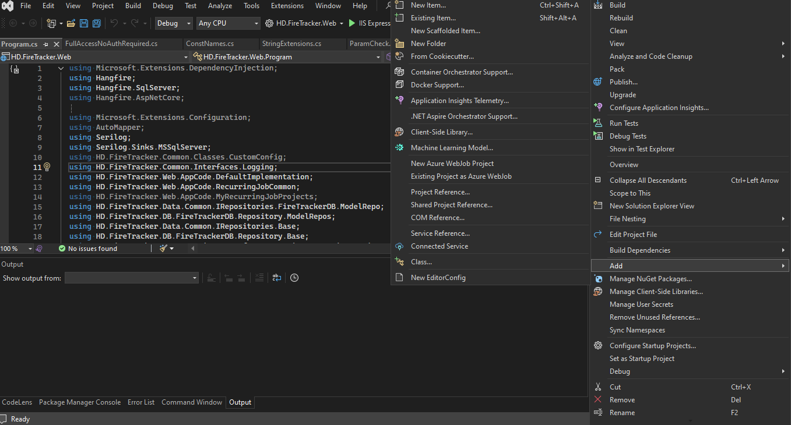
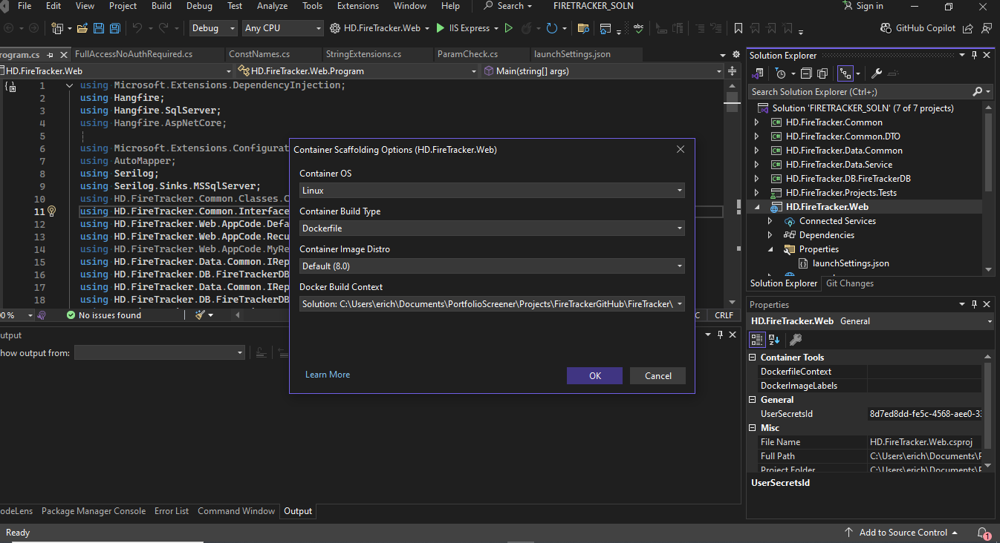
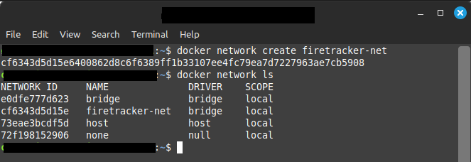

# Containerize a .NET Core Application:  Adding Support To Containerize The FireTracker Dashboard With Docker

 

## Introduction

Previously we introduced FireTracker, a Recurring Process Tracking Dashboard for Hangfire.  It has a web-based front-end that tracks jobs with persistent backend storage.  In the example presented, we used an ASP.NET Core Web App for the FireTracker front end (.NET 8.0) and SQL Server for the persistent storage backend.

Now we will containerize the FireTracker app, creating Docker images for both the web application and SQL Server, and having our web app Container connect to our SQL Server Container for storage.

## Creating A Dockerfile For The Web Application

We start the process of containerizing the FireTracker app by creating a Dockerfile for the solution.  The Dockerfile contains instructions used to build a Docker Image.  There are quite a few options available when configuring a [Dockerfile](https://docs.docker.com/reference/dockerfile/).  It can seem complicated at first, but one way to get a head start in creating a Dockerfile is to use the Docker support tools in Visual Studio.

We begin by right clicking on the web application and clicking on Add --> Docker Support.



This brings up a dialog box with Container Scaffolding Options.  We will go with the default options, click Ok, and let Visual Studio generate the Dockerfile.



The dialog generates the Dockerfile (which we moved to the base directory after some trial and error).  The generated Dockerfile is mainly what we need, however I've added curl and mssql tools (lines beginning/ending with # ADDITIONAL TOOLS FOR DEBUGGING) to help with troubleshooting any errors within the container.

```dockerfile
# See https://aka.ms/customizecontainer to learn how to customize your debug container and how Visual Studio uses this Dockerfile to build your images for faster debugging.

# This stage is used when running from VS in fast mode (Default for Debug configuration)
FROM mcr.microsoft.com/dotnet/aspnet:8.0 AS base

# ADDITIONAL TOOLS FOR DEBUGGING
ENV BUILDX_BUILDER=desktop-linux
ENV ACCEPT_EULA=Y

USER root
RUN apt-get -y update
RUN apt-get -y install curl

RUN curl https://packages.microsoft.com/keys/microsoft.asc | tee /etc/apt/trusted.gpg.d/microsoft.asc

RUN curl https://packages.microsoft.com/config/ubuntu/20.04/prod.list | tee /etc/apt/sources.list.d/mssql-release.list

RUN apt-get update
RUN apt-get install -y --no-install-recommends mssql-tools18 unixodbc-dev

# END ADDITIONAL TOOLS FOR DEBUGGING

USER app
WORKDIR /app
EXPOSE 8080
EXPOSE 8081


# This stage is used to build the service project
FROM mcr.microsoft.com/dotnet/sdk:8.0 AS build
ARG BUILD_CONFIGURATION=Release
WORKDIR /src
COPY ["HD.FireTracker.Web/HD.FireTracker.Web.csproj", "HD.FireTracker.Web/"]
COPY ["HD.FireTracker.Common.DTO/HD.FireTracker.Common.DTO.csproj", "HD.FireTracker.Common.DTO/"]
COPY ["HD.FireTracker.Common/HD.FireTracker.Common.csproj", "HD.FireTracker.Common/"]
COPY ["HD.FireTracker.Data.Common/HD.FireTracker.Data.Common.csproj", "HD.FireTracker.Data.Common/"]
COPY ["HD.FireTracker.Data.Service/HD.FireTracker.Data.Service.csproj", "HD.FireTracker.Data.Service/"]
COPY ["HD.FireTracker.DB.FireTrackerDB/HD.FireTracker.DB.FireTrackerDB.csproj", "HD.FireTracker.DB.FireTrackerDB/"]
RUN dotnet restore "./HD.FireTracker.Web/HD.FireTracker.Web.csproj"
COPY . .
WORKDIR "/src/HD.FireTracker.Web"
RUN dotnet build "./HD.FireTracker.Web.csproj" -c $BUILD_CONFIGURATION -o /app/build

# This stage is used to publish the service project to be copied to the final stage
FROM build AS publish
ARG BUILD_CONFIGURATION=Release
RUN dotnet publish "./HD.FireTracker.Web.csproj" -c $BUILD_CONFIGURATION -o /app/publish /p:UseAppHost=false

# This stage is used in production or when running from VS in regular mode (Default when not using the Debug configuration)
FROM base AS final
WORKDIR /app
COPY --from=publish /app/publish .
ENTRYPOINT ["dotnet", "HD.FireTracker.Web.dll"]
```

Now that we have the Dockerfile for the web app, we are ready to start building our containerized application.

## Connecting Containers With A Docker Network

Before we create the FireTracker database and application images, we will need to create a Docker [network](https://docs.docker.com/reference/cli/docker/network/) that both of the containers will use.  Docker makes this a breeze to do.  Simply open up a new terminal and use the following command:

```bash
docker network create firetracker-net
```

This created a new network named "firetracker-net". We can confirm that this network was created by listing out all of the available docker networks:

```bash
docker network ls
```



If you want more a more detailed listing of the newly created network, use the following command to inspect the network:

```bash
docker network inspect firetracker-net
```

## Create Base SQL Server Image

The files needed to create our FireTracker Docker environment are available in our GitHub [repository]((https://github.com/HildebrandDevelopment/FireTracker.git)).  Once you have downloaded the FireTracker project files, browse to the /resources/Database/SqlServerBaseDockerImg subdirectory.  This folder has a Docker file that will create a base image of SQL Server that we will use in the rest of this project.  After browsing to the folder, create a terminal and use the following command to begin building the image:

```bash
docker build -t hd/sqlserver2022:base .
```

Once the image has finished building, we can see that it is available in Docker Desktop.


Now that we have a base SQL Server image, we will customize the image to create a new base image that can be reused again and again with our FireTracker application.
We will do this by creating a container from our base SQL Server image, executing a series of SQL scripts against the SQL Server instance running on the container, as well as letting Hangfire automatically create the tables it needs through an initial run of the FireTracker app.  Once this is done, a new base image can be created from the container.

## Create Container From Base SQL Server Image

To start the SQL Server container, open up a new terminal and use the following command:

```bash
docker run -d -p 1433:1433 \
-e "MSSQL_SA_PASSWORD=Pwd123#sa_pwd#" -e "SQLCMDPASSWORD=Pwd123#sa_pwd#" \
--net=firetracker-net \
--name configure-firetracker-db-container hd/sqlserver2022:base
```


Once we run this command, we can go to Docker Desktop to see if the container is running.


You can use your favorite database management user interface tool to view the newly created database server. We see though the UI that SQL Server has been created.  


## Run Initial FireTracker Database Creation Scripts

-------------

Currently only the master database exists. To run our FireTracker app, we will need a new FireTracker database (with necessary tables created).

To build this, browse to the /resources/Database/DBScripts folder and open up a new terminal. From here we will use sqlcmd to connect to the database running in the container and run our database creation script files.

```bash
##enable creation of sql auth accounts on SQL Server
sqlcmd -S localhost,1433 -U sa -P Pwd123#sa_pwd# -d master -C -i 00_ServerEnableSqlAuth.sql

##create the FireTracker database
sqlcmd -S localhost,1433 -U sa -P Pwd123#sa_pwd# -d master -C -i 01_CreateFiretrackerDB.sql

##create the login
sqlcmd -S localhost,1433 -U sa -P Pwd123#sa_pwd# -d FireTrackerDb -C -i 02_CreateLogin.sql

##add login to FireTracker
sqlcmd -S localhost,1433 -U sa -P Pwd123#sa_pwd# -d FireTrackerDb -C -i 03_AddUserToDB.sql

##add FireTracker tables
sqlcmd -S localhost,1433 -U sa -P Pwd123#sa_pwd# -d FireTrackerDb -C -i 50_Table_HangFireEvents.sql

sqlcmd -S localhost,1433 -U sa -P Pwd123#sa_pwd# -d FireTrackerDb -C -i 51_Table_RecurringProcess.sql

sqlcmd -S localhost,1433 -U sa -P Pwd123#sa_pwd# -d FireTrackerDb -C -i 52_Table_RecurringProcessDetail.sql
```

We see that the database creation scripts ran successfully and created the FireTrackerDb database and associated tables.


Part of the database creation scripts involve creating an account that our FireTracker application will use to connect to the database.  We can verify that this is working by using sqlcmd to connect to the database in the terminal using the command below.  If successful sqlcmd will stand ready to take commands (use CTRL+C to terminate).


## Run Hangfire To Complete Database Initialization

On its first run, Hangfire will initialize the setup of all of the database objects that it needs to run the application.  We will take advantage of this by creating a container with our FireTracker app and running it so Hangfire completes its database initialization. Then we will close out the web app and stop the container, and create a new base database image from the database container.

Open a new terminal and enter the following command to create the container.

```bash
docker run -d -p 8080:8080 -e "ASPNETCORE_ENVIRONMENT=Development" \
-e ConnectionStrings__HangfireConnection="Server=configure-firetracker-db-container.firetracker-net,1433;Database=FireTrackerDb;User Id=firetracker_app;Password=Pwd123#fta_pwd#;TrustServerCertificate=True;" \
-e "HANGFIRE_DASHBOARD_VISIBILITY=CONTAINER_DEVELOPMENT_NO_AUTH" \
--net=firetracker-net \
--name configure-firetracker-app-container hd/firetracker-app:init
```

Going to Docker Desktop we now see that the FireTracker app container is running, as well as the database container.


Now browse to the FireTracker application http://localhost:8080 to see if it is running. If successful, you will see the home page below. Next click on the Hangfire Dashboard to see if the dashboard works.


Now we are able to see the Hangfire Dashboard.


As part of its initial run, Hangfire creates its database schema and tables.  This can be seen by checking the DBMS UI.


## Create New Base Database Image

We are almost done finalizing the database image that we will use for Hangfire. 


First we will go to Docker Desktop and stop both the app and database containers.


Then copy the Container ID of the database container.  We will use this to run the commit command and create our new base database image.

`Current Database Container ID: c56bd87c098dde5d95d0d97572ba0f4174525a4d6155fe5b7d0fdc9657ddc6fd`


Open a terminal and run the following commit command.

`docker commit c56bd87c098dde5d95d0d97572ba0f4174525a4d6155fe5b7d0fdc9657ddc6fd hd/firetracker-db:init`


Once the commit command completes, we can go to Docker Desktop and now see our newly created base database image.


## Start Using FireTracker App And New Database Image

Now that we a newly configured database image with all of the database objects needed to run our FireTracker app, we can test it out by launching new containers.


But first we will delete the containers we used to create new database image (the database container was using an intermediate name and the app container was pointing to it). This can be done using Docker Desktop by going to Containers -> Actions and clicking Delete.


Once this is done, open up a new terminal and run the following commands:

***Create Database Container***

```bash
docker run -d -p 1433:1433 \
-e "MSSQL_SA_PASSWORD=Pwd123#sa_pwd#" -e "SQLCMDPASSWORD=Pwd123#sa_pwd#" \
--net=firetracker-net \
--name firetracker-db-container hd/firetracker-db:init
```

It may take a while for SQL Server to start on the newly run container.  Wait a few minutes, and then try connecting to the database with sqlcmd.

`sqlcmd -S localhost,1433 -U firetracker_app -P Pwd123#fta_pwd# -d FireTrackerDb -C`

Once you are able to connect to the database, proceed with the next step of running the web app container.


***Create Web App Container***

```bash
docker run -d -p 8080:8080 -e "ASPNETCORE_ENVIRONMENT=Development" \
-e ConnectionStrings__HangfireConnection="Server=firetracker-db-container.firetracker-net,1433;Database=FireTrackerDb;User Id=firetracker_app;Password=Pwd123#fta_pwd#;TrustServerCertificate=True;" \
-e "HANGFIRE_DASHBOARD_VISIBILITY=CONTAINER_DEVELOPMENT_NO_AUTH" \
--net=firetracker-net \
--name firetracker-app-container hd/firetracker-app:init
```

Once the web app container command completes, you should be able to see both containers running in Docker Desktop.


Go ahead and browse to the FireTracker app again ( http://localhost:8080 ) .

You should be able to see the FireTracker Home page, the Hangfire Dashboard, and the Swagger UI Dashboard.  If so then congrats!  You have a FireTracker application environment in Docker!

## 
